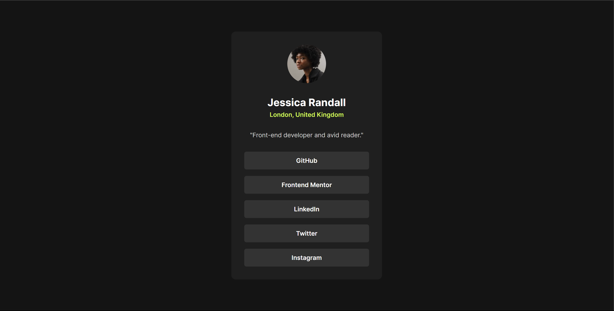

# Frontend Mentor - Social links profile solution

This is a solution to the [Social links profile challenge on Frontend Mentor](https://www.frontendmentor.io/challenges/social-links-profile-UG32l9m6dQ). Frontend Mentor challenges help you improve your coding skills by building realistic projects. 

## Table of contents

- [Overview](#overview)
  - [The challenge](#the-challenge)
  - [Screenshot](#screenshot)
  - [Links](#links)
- [My process](#my-process)
  - [Built with](#built-with)
  - [What I learned](#what-i-learned)
  - [Continued development](#continued-development)
  - [Useful resources](#useful-resources)
- [Author](#author)

**Note: Delete this note and update the table of contents based on what sections you keep.**

## Overview

### The challenge

Users should be able to:

- See hover and focus states for all interactive elements on the page

### Screenshot



### Links

- Solution URL: [https://www.frontendmentor.io/solutions/social-links-profile-SEOeOSsy2N](https://www.frontendmentor.io/solutions/social-links-profile-SEOeOSsy2N)
- Live Site URL: [https://yetithesleepingchancellor.github.io/social-links-profile/](https://yetithesleepingchancellor.github.io/social-links-profile/)

## My process

### Built with

- Semantic HTML5 markup
- CSS custom properties
- Flex-box

### What I learned

```css
.nav a {
    display: block;
    width: 100%;
    color: var(--white);
    background-color: var(--Grey-700);
    padding: 12px 0;
    border-radius: 5px;
    font-size: 0.9rem;
    font-weight: 600;
}
```

## Author

- Website - [Sandip Tamang](https://www.tamangsandip.com.np)
- Frontend Mentor - [@YetiTheSleepingChancellor](https://www.frontendmentor.io/profile/YetiTheSleepingChancellor)
- Linkedin - [Sandip Tamang](https://www.linkedin.com/in/sandiptamang/)

